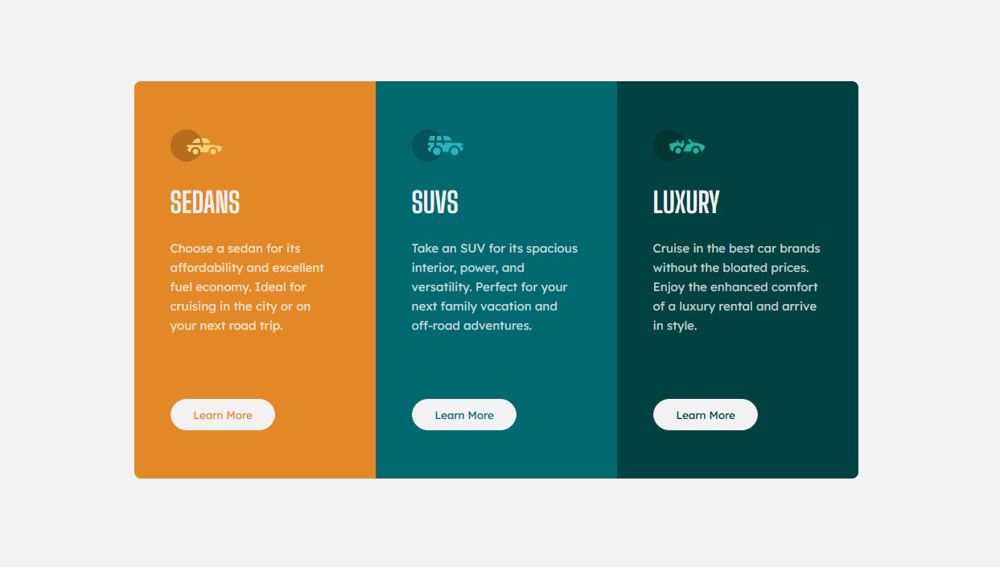

# FM_3-column-preview-card

# Frontend Mentor - 3 column preview card solution

This is a solution to the [3-column preview card component on Frontend Mentor](https://www.frontendmentor.io/challenges/3column-preview-card-component-pH92eAR2-). Frontend Mentor challenges help you improve your coding skills by building realistic projects.

### The challenge

Your challenge is to build out this 3-column preview card component and get it looking as close to the design as possible.

You can use any tools you like to help you complete the challenge. So if you've got something you'd like to practice, feel free to give it a go.

Your users should be able to:

-   View the optimal layout depending on their device's screen size
-   See hover states for interactive elements

### Screenshot

### Links

-   Solution URL: [https://www.frontendmentor.io/solutions/3-column-preview-html-css-only-Yf_OPcpq6](https://www.frontendmentor.io/solutions/3-column-preview-html-css-only-Yf_OPcpq6)
-   Live site: [GitHub Pages](https://dponline-nl.github.io/FM_3-column-preview-card/)

### Author

-   Website - [DPonline](https://www.dponline.nl)
-   Frontend Mentor - [@dponline-nl](https://www.frontendmentor.io/profile/dponline-nl)
